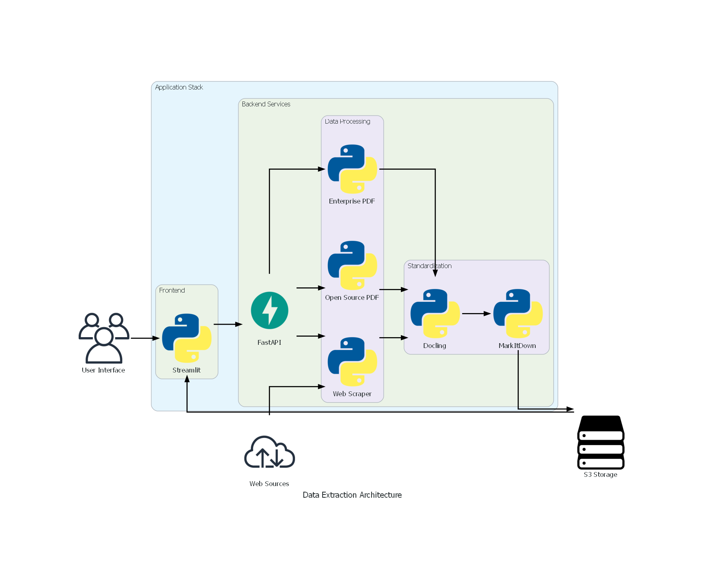

author: Group2
summary: AI-Powered Document Processing Pipeline with PDF/Web Extraction and Cloud Storage
id: document-processing-codelab
categories: AI, Web Scraping, Cloud
environments: Web
status: Published


# AI-Powered Document Processing System

## Overview


### What You'll Learn
- Extract text from PDFs using both enterprise (Adobe pdf extraction api) and open-source (PyPDF2) methods
- Scrape web content with BeautifulSoup and Diffbot
- Standardize documents using Docling and MarkItDown
- Store processed files in AWS S3
- Build full-stack app with Streamlit + FastAPI

### Prerequisites
- Python 3.12
- AWS Account (for S3)
- Adobe PDF Extract API



## Environment Setup

### Clone Repository & Install Dependencies
```bash
git clone git@github.com:Neneanuj/Data_Extraction_Platform.git
```

### Configure Environment Variables
Create `.env` file:
```ini
# AWS Configuration
AWS_ACCESS_KEY_ID=your_key
AWS_SECRET_ACCESS_KEY=your_secret
AWS_REGION=your_region

#Diffbot
DIFFBOT_TOKEN=your_token

#Adobe
PDF_SERVICES_CLIENT_ID=your_key
PDF_SERVICES_CLIENT_SECRET=your_secret
```
## S3
```python webapp/backend/src/S3/s3_organization.py
def generate_presigned_url(bucket: str, key: str, expiration=3600) -> str:
    """Generate a presigned URL for downloading from S3 with enterprise-level security configuration."""
    s3_client = boto3.client('s3', config=boto3.session.Config(signature_version='s3v4'))
    try:
        return s3_client.generate_presigned_url(
            'get_object',
            Params={'Bucket': bucket, 'Key': key},
            ExpiresIn=expiration
        )
    except ClientError as e:
        raise RuntimeError(f"Failed to generate presigned URL: {str(e)}")

def upload_to_s3(bucket_name: str, s3_key: str, data: Union[bytes, str]) -> None:
    """
    Upload a file or byte data to a specified S3 bucket.

    :param bucket_name: The name of the target S3 bucket
    :param s3_key: The target key (path) in S3
    :param data: Can be either a file path (str) or byte data (bytes)
    """
    try:
        s3 = boto3.client('s3')
        if isinstance(data, bytes):
            # Handle byte data
            s3.put_object(Bucket=bucket_name, Key=s3_key, Body=data)
        else:
            # Handle file path
            s3.upload_file(Filename=data, Bucket=bucket_name, Key=s3_key)
    except Exception as e:
        raise Exception(f"Failed to upload to S3: {str(e)}")

def generate_s3_key(file_type: str, file_name: str) -> str:
    """
    Generate an S3 key for storing files.
    """
    timestamp = datetime.now().strftime('%Y%m%d_%H%M%S')
    return f"{file_type}/{timestamp}_{file_name}"

def download_from_s3(bucket_name: str, object_name: str, file_path: str) -> None:
    """
    Download a file from an S3 bucket.
    """
    s3_client = boto3.client('s3')
    try:
        s3_client.download_file(bucket_name, object_name, file_path)
    except Exception as e:
        raise Exception(f"Failed to download from S3: {str(e)}")
```
## PDF Processing Module with Enterprise Service


### Enterprise Parser (Adobe pdf extract api)

```python webapp/backend/src/extraction/pdf_parser_enterprise.py
def extract_and_store_pdf(pdf_path: str, bucket_name: str):
    """Core processing logic"""
    base_key = generate_s3_base_key(pdf_path)
    s3_client = boto3.client("s3")

    try:
        # Retrieve PDF content from S3
        response = s3_client.get_object(Bucket=bucket_name, Key=pdf_path)
        pdf_byte_data = response["Body"].read()

        # Initialize Adobe services
        credentials = ServicePrincipalCredentials(
            client_id=os.getenv('PDF_SERVICES_CLIENT_ID'),
            client_secret=os.getenv('PDF_SERVICES_CLIENT_SECRET')
        )
        pdf_services = PDFServices(credentials=credentials)

        # Upload byte data directly (following the official example)
        input_asset = pdf_services.upload(input_stream=pdf_byte_data, mime_type=PDFServicesMediaType.PDF)

        # Configure extraction parameters
        extract_pdf_params = ExtractPDFParams(
            elements_to_extract=[ExtractElementType.TEXT, ExtractElementType.TABLES],
            elements_to_extract_renditions=[ExtractRenditionsElementType.TABLES, ExtractRenditionsElementType.FIGURES]
        )

        # Submit the job
        extract_pdf_job = ExtractPDFJob(input_asset=input_asset, extract_pdf_params=extract_pdf_params)
        location = pdf_services.submit(extract_pdf_job)
        result = pdf_services.get_job_result(location, ExtractPDFResult)

        # Process the result (key fixing point)
        result_asset: CloudAsset = result.get_result().get_resource()
        stream_asset: StreamAsset = pdf_services.get_content(result_asset)
        
        # Directly get byte data, no need to call read()
        zip_data = stream_asset.get_input_stream()  # Removed .read()

        # Store the original ZIP
        raw_zip_key = f"{base_key}extracted_data.zip"
        upload_to_s3(bucket_name, raw_zip_key, zip_data)

        # Parse and categorize storage
        with zipfile.ZipFile(BytesIO(zip_data)) as archive:
            # ... subsequent processing remains unchanged ...

            return {"download_url": create_presigned_url(bucket_name, raw_zip_key)}

    except (ServiceApiException, ServiceUsageException, SdkException) as e:
        logging.error(f"Adobe API error: {str(e)}")
        raise RuntimeError(f"Document processing failed: {str(e)}")
    except Exception as e:
        logging.error(f"System error: {str(e)}")
        raise RuntimeError(f"System processing exception: {str(e)}")
```

## PDF Processing Module with Opensource Tool

### Open-Source Parser (PyPDF2)

```python webapp/backend/src/extraction/pdf_parser_opensource.py
def process_pdf_with_open_source(pdf_source: str) -> Dict[str, Any]:
    """
    Parse PDF and return:
      - "docling_markdown": the string after docling conversion
      - "markitdown_markdown": the string after markitdown conversion
      - "images_dir": the directory where images are extracted
      - "tables_dir": the directory where tables (CSV) are extracted
    """
    # If the input is a remote URL, download it to a local temporary file
    if pdf_source.lower().startswith("http"):
        with tempfile.NamedTemporaryFile(delete=False, suffix=".pdf") as tmp:
            response = requests.get(pdf_source)
            tmp.write(response.content)
            pdf_path = tmp.name
    else:
        # If it is a local file, use it directly
        pdf_path = pdf_source

    # Extract images to a temporary folder
    images_dir = tempfile.mkdtemp()
    _extract_images(pdf_path, images_dir)

    # Extract tables to a temporary folder
    tables_dir = tempfile.mkdtemp()
    _extract_tables(pdf_path, tables_dir)

    # Extract pure text
    text_content = _extract_text_only(pdf_path)

    # Optionally, if you want to delete the temporary PDF, you can do it here
    # However, if the pdf_source was a local file, it may not need to be deleted. This depends on the scenario.
    if pdf_source.lower().startswith("http"):
        os.remove(pdf_path)

    # Write this text to a temporary .md file for docling/markitdown parsing
    with tempfile.NamedTemporaryFile(delete=False, suffix=".md") as tmp_file:
        tmp_file.write(text_content.encode("utf-8"))
        tmp_file_path = tmp_file.name

    docling_md = docling_convert(tmp_file_path)
    os.remove(tmp_file_path)

    with tempfile.NamedTemporaryFile(delete=False, suffix=".txt") as tmp_file2:
        tmp_file2.write(text_content.encode("utf-8"))
        tmp_path_txt2 = tmp_file2.name

    markitdown_md = markitdown_convert(tmp_path_txt2)
    os.remove(tmp_path_txt2)

    # Return relevant information
    return {
        "docling_markdown": docling_md,
        "markitdown_markdown": markitdown_md,
        "images_dir": images_dir,
        "tables_dir": tables_dir
    }

def _extract_images(pdf_path: str, output_dir: str):
    """Extract all images using PyMuPDF to a specified directory"""
    doc = fitz.open(pdf_path)
    for page_num in range(len(doc)):
        page = doc.load_page(page_num)
        for img_index, img in enumerate(page.get_images(full=True)):
            xref = img[0]
            base_image = doc.extract_image(xref)
            image_ext = base_image["ext"]
            image_filename = f"page{page_num+1}_img{img_index+1}.{image_ext}"
            image_path = os.path.join(output_dir, image_filename)
            with open(image_path, "wb") as f:
                f.write(base_image["image"])
    doc.close()

def _extract_tables(pdf_path: str, output_dir: str):
    """Extract tables using pdfplumber into CSV files"""
    with pdfplumber.open(pdf_path) as pdf:
        for page_num, page in enumerate(pdf.pages):
            tables = page.extract_tables()
            print(f"Page {page_num+1} - tables found: {len(tables)}")  # Displaying the number of tables found
            for t_idx, table in enumerate(tables):
                csv_filename = f"page{page_num+1}_table{t_idx+1}.csv"
                csv_path = os.path.join(output_dir, csv_filename)
                with open(csv_path, "w", newline="", encoding="utf-8") as csv_file:
                    writer = csv.writer(csv_file)
                    writer.writerows(table)

def _extract_text_only(pdf_path: str) -> str:
    """Extract text using pdfplumber and concatenate into a single string"""
    lines = []
    with pdfplumber.open(pdf_path) as pdf:
        for page in pdf.pages:
            text = page.extract_text()
            if text:
                lines.append(text.strip())
    return "\n".join(lines)
```

## Web Content Extraction with Opensource Tool


### BeautifulSoup Implementation
```python webapp/backend/src/extraction/web_scraper_opensourse.py
def parse_url(url):
    """Fetch and parse HTML content"""
    valid, error_message = is_valid_url(url)
    if not valid:
        return None, error_message
    try:
        headers = {"User-Agent": "Mozilla/5.0 (Windows NT 10.0; Win64; x64)"}
        response = requests.get(url, headers=headers)
        soup = BeautifulSoup(response.content, 'html.parser')
        return soup, None
    except Exception as e:
        return None, f"Failed to parse URL: {str(e)}"

def extract_clean_text(soup):
    """Extract and clean text"""
    try:
        return re.sub(r'\s+', ' ', soup.get_text()).strip(), None
    except Exception:
        return None, "Text extraction failed"

def extract_urls(soup, base_url):
    """Extract URLs with metadata from HTML"""
    try:
        urls = []
        for i, link in enumerate(soup.find_all('a')):
            href = link.get('href')
            if href:
                urls.append({
                    'position': i + 1,
                    'url': urljoin(base_url, href),
                    'text': link.text.strip(),
                    'title': link.get('title', 'N/A')
                })
        return urls, None
    except Exception:
        return None, "URL extraction failed"

def extract_images(soup, base_url):
    """Extract images with metadata (NOT the actual image files, just info)"""
    try:
        images = []
        for i, img in enumerate(soup.find_all('img')):
            src = img.get('src', '')
            if not src:
                continue
            abs_src = urljoin(base_url, src)
            images.append({
                'position': i + 1,
                'alt': img.get('alt', '').strip(),
                'src': abs_src,
                'width': img.get('width', 'N/A'),
                'height': img.get('height', 'N/A')
            })
        return images, None
    except Exception:
        return None, "Image extraction failed"

def extract_tables(soup):
    """Extract tables from HTML (as DataFrame list)"""
    try:
        tables = []
        for table in soup.find_all('table'):
            headers = [th.text.strip() for th in table.find_all('th')]
            if not headers and table.find('tr'):
                headers = [f'Column_{i}' for i in range(len(table.find('tr').find_all('td')))]
            
            rows = []
            for tr in table.find_all('tr'):
                tds = tr.find_all('td')
                if tds and len(tds) == len(headers):
                    row_data = [td.text.strip() for td in tds]
                    rows.append(row_data)
            
            if rows:
                df = pd.DataFrame(rows, columns=headers)
                tables.append(df)
        return tables, None
    except Exception:
        return None, "Table extraction failed"

def scrape_url_and_convert(url: str):
    """
    Publicly exposed scraping and conversion function:
    1) Parse URL -> Extract text, images, tables, and links
    2) Convert extracted text into docling.md and markitdown.md
    Returns:
    {
      "docling_markdown": str,
      "markitdown_markdown": str,
      "text_raw": str,    # Optionally, saves the original extracted text
      "images": [...],    # Metadata of images
      "tables": [DataFrame1, DataFrame2, ...],
      "urls": [...],      # Metadata of links
      "error": None or "xxxxx"
    }
    """
    soup, error = parse_url(url)
    if error:
        return {"error": error}

    # Extract text
    text_data, err_text = extract_clean_text(soup)
    if err_text:
        return {"error": err_text}

    # Extract URLs
    urls_data, err_urls = extract_urls(soup, url)
    if err_urls:
        urls_data = []

    # Extract images metadata
    images_data, err_imgs = extract_images(soup, url)
    if err_imgs:
        images_data = []

    # Extract tables
    tables_data, err_tables = extract_tables(soup)
    if err_tables:
        tables_data = []

    # Convert text_data to docling.md and markitdown.md
    with tempfile.NamedTemporaryFile(delete=False, suffix=".md") as tmp_md:
        tmp_md.write(text_data.encode("utf-8"))
        tmp_md_path = tmp_md.name

    docling_md = ""
    markitdown_md = ""
    try:
        docling_md = docling_convert(tmp_md_path)
    except Exception as e:
        docling_md = f"Docling conversion failed: {e}"

    try:
        markitdown_md = markitdown_convert(tmp_md_path)
    except Exception as e:
        markitdown_md = f"Markitdown conversion failed: {e}"

    # Delete temporary file after use
    os.remove(tmp_md_path)

    return {
        "error": None,
        "docling_markdown": docling_md,
        "markitdown_markdown": markitdown_md,
        "text_raw": text_data,
        "images": images_data,
        "tables": tables_data,
        "urls": urls_data
    }
```

## Web Content Extraction with Service
### Diffbot
```python webapp/backend/src/extraction/web_scraper_enterprise.py
def scrape_url_with_diffbot(url, output_file="scraped_data.md"):
    api_url = "https://api.diffbot.com/v3/analyze"
    token = os.environ.get("DIFFBOT_TOKEN")
    
    if not token:
        logger.error("DIFFBOT_TOKEN environment variable not set.")
        return {"error": "DIFFBOT_TOKEN environment variable not set."}
    
    params = {
        'token': token,
        'url': url
    }
    
    try:
        response = requests.get(api_url, params=params)
        response.raise_for_status()
        data = response.json()
        
        
        markdown_content = f"# Scraped Data Report\n\n"
        markdown_content += f"## Source URL\n{url}\n\n"
        markdown_content += f"## Timestamp\n{datetime.now().strftime('%Y-%m-%d %H:%M:%S')}\n\n"
        markdown_content += "## Extracted Content\n"
        markdown_content += "```\n"  
        markdown_content += json.dumps(data, indent=2)
        markdown_content += "\n```\n"
        
    
        with open(output_file, 'w', encoding='utf-8') as f:
            f.write(markdown_content)
        
        logger.info(f"Data has been saved to {output_file}")
        return data
        
    except requests.RequestException as e:
        logger.error(f"Error during scraping: {e}")
        return {"error": str(e)}
```
## Standardization Process


### Apply Docling Rules
```python webapp/backend/src/standardization/docling_utils.py
def docling_convert(source: str) -> str:
    """
    Convert a PDF (or URL) to a markdown text in a technical style using Docling.
    
    :param source: Path to a PDF file or a URL
    :return: Markdown text after conversion by Docling
    """
    converter = DocumentConverter()
    result = converter.convert(source)
    return result.document.export_to_markdown()
```


### MarkItDown Conversion
```python webapp/backend/src/standardization/markitdown_utils.py
def markitdown_convert(file_path: str) -> str:
    """
    Convert a file (such as .xlsx or .pdf) into Markdown text using MarkItDown.
    
    :param file_path: The path to the file
    :return: Markdown text after conversion by MarkItDown
    """
    md = MarkItDown()
    result = md.convert(file_path)
    return result.text_content
```

## API 
### Pdf_Enterprise
```python
@app.post("/upload_pdf_enterprise")
```
### Pdf_Opensource
```python
@app.post("/upload_pdf_opensource")
```
### Scrape_opensourse
```python
@app.post("/scrape_webpage")
```
### Scrape_Enterprise
```python
@app.post("/scrape_diffbot")
```

## Test locally
### Backend
```bash
cd webapp/backend/src/api
uvicorn main:app
```
### Frontend(Replace localhost url)
```bash
cd webapp/frontend/src
streamlit run main.py
```


## Deployment
### Dockerfile
```bash
docker build --platform=linux/amd64 -t gcr.io/YOUR_PROJECT_ID/fastapi-app .
docker run --rm -it --env-file .env --platform linux/amd64 gcr.io/YOUR_PROJECT_ID/fastapi-app
docker push gcr.io/YOUR_PROJECT_ID/fastapi-app
gcloud run deploy fastapi-service \
  --image gcr.io/YOUR_PROJECT_ID/fastapi-app \
  --platform managed \
  --region us-east1 \
  --allow-unauthenticated
```


